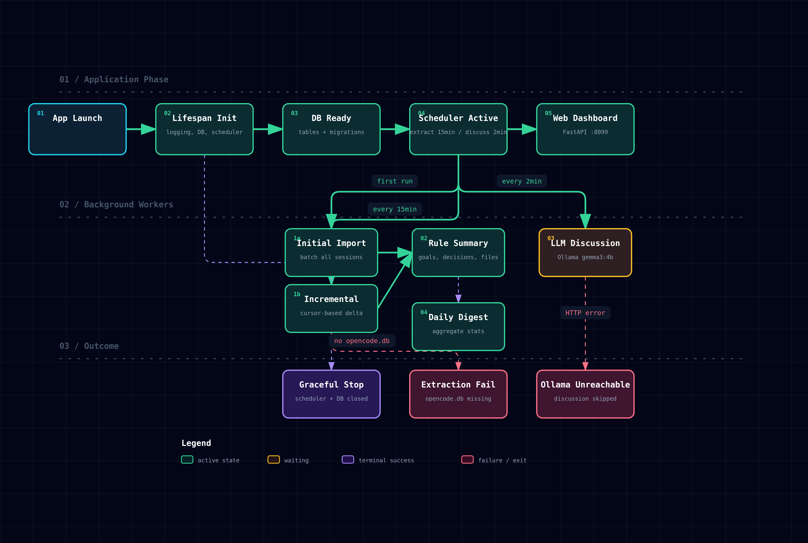

# sessions-sage

Your OpenCode sessions — summarized, searchable, visual.

**What it does:**  
Connect to OpenCode, pull session data, run it through an AI (Ollama + Gemma), and see everything on a clean web dashboard. Daily digests. Discussion summaries. Project timelines. No manual log hunting.

**How it works — at a glance:**



1. **Extract** — reads session data from OpenCode's database  
2. **Summarize** — Ollama (running locally) generates readable summaries  
3. **Explore** — browse, filter, search your sessions on a dashboard  
4. **Reflect** — daily digests show what you shipped and where you got stuck

---

### Tech stack

| Piece | What |
|---|---|
| Backend | Python + FastAPI |
| AI | Ollama + gemma3:4b |
| Database | SQLite |
| Dashboard | HTML + HTMX (no JS framework) |

### Quick start

```bash
make run
```

Opens at `http://localhost:8099`.

---

### Project status

Active development — see [ROADMAP.yaml](ROADMAP.yaml) for what's next.
